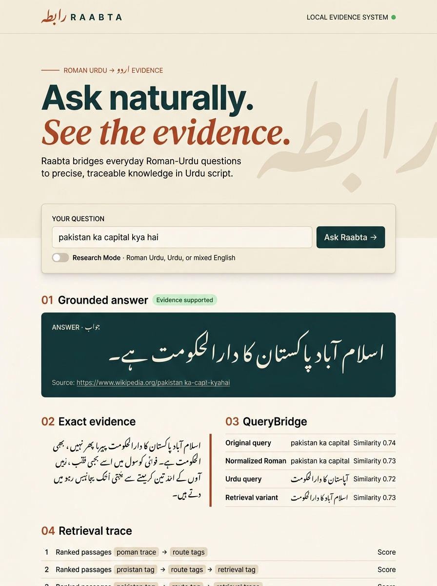

<p align="center">
  <strong>رابطہ</strong>
</p>

<h1 align="center">RAABTA</h1>

<p align="center">
  <em>Script-Aware Multi-Query Reformulation &amp; Evidence Retrieval for Roman-Urdu Questions</em>
</p>

<p align="center">
  <a href="https://github.com/HasnatKhan010/raabta/actions/workflows/ci.yml"></a>
  
  
  
  
</p>

<p align="center">
  
  
  
  
  
</p>

---

## Overview

**Raabta** (رابطہ — *connection*) is a CPU-first information-retrieval research system that bridges noisy Roman-Urdu questions to evidence stored in Urdu script. It investigates whether controlled, meaning-preserving multi-query reformulation can improve retrieval effectiveness over direct retrieval, single transliteration, and standard hybrid approaches.

> **Research question:** *Can script-aware multi-query reformulation improve retrieval effectiveness for noisy Roman-Urdu questions over Urdu-script knowledge bases compared with direct retrieval, single transliteration, and standard hybrid retrieval?*

The system preserves the original query, generates normalized, Urdu-script, and conservative expansion views through **QueryBridge**, retrieves via BM25 and multilingual dense search, fuses ranks with Reciprocal Rank Fusion, optionally reranks candidates with a multilingual cross-encoder, and returns extractive evidence — or honestly abstains when evidence is insufficient.

<br>

<p align="center">
  
</p>
<p align="center"><em>The Raabta interface: type a Roman-Urdu question and receive grounded, traceable Urdu-script evidence</em></p>

---

## Architecture

```
                      ┌─────────────────────────────────────────────────────────────────┐
                      │                        Roman-Urdu Query                         │
                      └──────────────────────────────┬──────────────────────────────────┘
                                                     ▼
                                          ┌─────────────────────┐
                                          │    QueryBridge      │
                                          │  ┌───────────────┐  │
                                          │  │ Original      │  │
                                          │  │ Normalized    │  │  Semantic drift
                                          │  │ Urdu-script   │──│──threshold (0.55)
                                          │  │ Retrieval     │  │
                                          │  └───────────────┘  │
                                          └─────────┬───────────┘
                                           Accepted │ variants
                                    ┌───────────────┴───────────────┐
                                    ▼                               ▼
                          ┌──────────────────┐           ┌──────────────────┐
                          │  BM25 Retriever  │           │  Dense Retriever │
                          │  (per variant)   │           │ (multilingual-e5)│
                          └────────┬─────────┘           └────────┬─────────┘
                                   └───────────┬──────────────────┘
                                               ▼
                                    ┌─────────────────────┐
                                    │ Reciprocal Rank     │
                                    │ Fusion (RRF)        │
                                    └──────────┬──────────┘
                                               ▼
                                    ┌─────────────────────┐
                                    │ Multilingual        │
                                    │ Reranker (optional) │
                                    │ (gte-reranker-base) │
                                    └──────────┬──────────┘
                                               ▼
                                    ┌─────────────────────┐
                                    │ Extractive QA       │
                                    │ Evidence / Abstain  │
                                    └─────────────────────┘
```

---

## Key Features

- **QueryBridge** — Controlled, traceable multi-query reformulation with semantic drift gating
- **Hybrid retrieval** — BM25 + multilingual dense search (E5-small) with per-variant route tracking
- **Romanized-title retrieval** — Character-level matching between noisy Roman input and romanized Urdu article titles, with one lead passage per article
- **Reciprocal Rank Fusion** — Merges lexical and semantic signals across all query views
- **Multilingual reranking** — Optional cross-encoder reranker for deeper relevance scoring
- **Extractive grounded QA** — Returns exact evidence passages with similarity scores, or abstains
- **Conservative relevance controls** — Requires reranker relevance, meaningful query overlap, and the requested answer type before showing an answer
- **Optional live gap-filling** — User-enabled Urdu Wikipedia fallback for questions missing from the bounded local corpus; it is off by default
- **Research Mode** — Side-by-side comparison of all retrieval systems on any query
- **Full traceability** — The UI explains the converted query, candidate counts, confidence, decision reasons, source titles, routes, and latency
- **CPU-first** — Runs entirely on CPU; no GPU required

---

## Development Results

Measurements on 120 `project_verified` development questions. The locked 60-question test split is unused. External language review is outside the assignment scope.

| System | Recall@1 | Recall@5 | Recall@10 | MRR@10 | nDCG@10 |
|:---|:---:|:---:|:---:|:---:|:---:|
| Direct Dense | 0.050 | 0.083 | 0.092 | 0.062 | 0.069 |
| Single Transliteration + BM25 | 0.000 | 0.017 | 0.025 | 0.007 | 0.012 |
| Standard Hybrid (RRF) | 0.025 | 0.067 | 0.092 | 0.046 | 0.057 |
| **QueryBridge + RRF** | **0.050** | **0.100** | **0.167** | **0.075** | **0.096** |
| **QueryBridge + Reranker** | **0.125** | **0.175** | **0.183** | **0.144** | **0.154** |

QueryBridge improved Recall@10 by +0.075 absolute over baselines. The full reranker pipeline doubled early-rank precision (MRR@10: 0.062 → 0.144).

### Current application accuracy regression

After adding the romanized-title route, the same 120-question development-only retrieval check improved from **0.192 to 0.983 Recall@10**, from **0.117 to 0.875 Recall@5**, and from **0.101 to 0.583 MRR@10** before cross-encoder reranking. These are assignment regression measurements on a title-oriented set, not a guarantee for arbitrary questions. The locked test split remains unused.

---

## Corpus & Data

- **4,000** Urdu Wikipedia articles (20231101 snapshot)
- **16,352** traceable passages (150-token windows, 30-token overlap)
- **180** evidence-verified diagnostic questions with frozen 120/60 dev/test split
- Supporting transliteration lexicon built from Roman-Urdu parallel data

The local corpus is intentionally bounded, so it cannot contain every fact or current product price. Raabta now refuses low-confidence or wrong-shaped evidence instead of displaying a plausible-looking unrelated sentence. Live Urdu Wikipedia can be enabled per query when a broader search is appropriate; enabling it sends the converted query to Wikipedia.

---

## Tech Stack

| Layer | Technology |
|:---|:---|
| Core library | Python 3.11, sentence-transformers, rank-bm25, scikit-learn, uroman |
| Dense encoder | [multilingual-e5-small](https://huggingface.co/intfloat/multilingual-e5-small) |
| Reranker | [gte-multilingual-reranker-base](https://huggingface.co/Alibaba-NLP/gte-multilingual-reranker-base) |
| Backend | FastAPI + Uvicorn |
| Frontend | React + TypeScript + Vite |
| Data sources | [Wikimedia Wikipedia (Urdu)](https://huggingface.co/datasets/wikimedia/wikipedia), [Roman-Urdu-Parl-split](https://huggingface.co/datasets/Mavkif/Roman-Urdu-Parl-split) |

---

## Project Structure

```
raabta/
├── src/raabta/                # Core Python package
│   ├── querybridge/           #   QueryBridge multi-query reformulation
│   ├── retrieval/             #   BM25, dense retrieval, RRF, multi-query
│   ├── reranking/             #   Multilingual cross-encoder reranker
│   ├── evidence/              #   Extractive answering & curated answers
│   ├── preprocessing/         #   Text normalization & tokenization
│   ├── evaluation/            #   Metrics (Recall, MRR, nDCG)
│   └── data/                  #   I/O and data models
├── backend/                   # FastAPI REST API
├── frontend/                  # React/Vite web interface
│   └── src/                   #   TypeScript source
├── scripts/                   # Research & build scripts (24 scripts)
├── tests/                     # Test suite (11 test modules)
├── notebooks/                 # Reproducible Jupyter notebooks (7)
├── configs/                   # YAML configuration files
├── docs/                      # Research documentation & analysis
├── paper/                     # LaTeX source & research paper
├── data/                      # Data directory (large files git-ignored)
├── artifacts/                 # Models & embeddings (git-ignored)
├── pyproject.toml             # Package configuration
├── requirements.txt           # Pinned dependencies
├── setup.ps1                  # One-command environment setup
├── start_raabta.ps1           # Launch backend + frontend
└── stop_raabta.ps1            # Stop all services
```

---

## Quick Start

### Prerequisites

- **Python 3.11** (3.11 ≤ version < 3.13)
- **Windows** with PowerShell

### Setup

```powershell
# Clone the repository
git clone https://github.com/HasnatKhan010/raabta.git
cd raabta

# Create virtual environment and install dependencies
powershell -ExecutionPolicy Bypass -File .\setup.ps1
```

### Download data and models

After setup, activate the virtual environment and run the data pipeline:

```powershell
.\.venv\Scripts\Activate.ps1

# Download Wikipedia Urdu subset and Roman-Urdu parallel data
python scripts/download_data.py

# Build the passage corpus
python scripts/build_corpus.py

# Build the transliteration lexicon
python scripts/build_transliteration_lexicon.py

# Build dense embeddings
python scripts/build_dense_index.py
```

### Run the application

```powershell
powershell -ExecutionPolicy Bypass -File .\start_raabta.ps1
```

This launches the API server on `http://127.0.0.1:8000` and the web interface on `http://127.0.0.1:5173`.

### Stop

```powershell
powershell -ExecutionPolicy Bypass -File .\stop_raabta.ps1
```

### Run tests

```powershell
.\.venv\Scripts\Activate.ps1
pytest
```

---

## API Endpoints

| Method | Endpoint | Description |
|:---|:---|:---|
| `GET` | `/health` | Health check |
| `POST` | `/api/query` | Submit a query and get grounded evidence |
| `POST` | `/api/compare` | Compare all retrieval systems on a query |
| `GET` | `/api/source/{passage_id}` | Retrieve full passage by ID |
| `GET` | `/api/config` | Current system configuration |

---

## Documentation

| Document | Description |
|:---|:---|
| [Implementation plan](docs/implementation_plan.md) | Technical design and architecture |
| [Milestones](docs/milestones.md) | Phase-by-phase progress tracker |
| [Development results](docs/development_results.md) | Development-set evaluation metrics |
| [Phase 6 analysis](docs/phase6_analysis.md) | Robustness, ablation, latency analysis |
| [Grounded QA](docs/phase7_grounded_qa.md) | Extractive answering design |
| [Frontend validation](docs/phase9_frontend.md) | UI implementation and testing |
| [Portability validation](docs/phase10_validation.md) | Clean-room reproducibility checks |


---

## Research Integrity

- Gold supervision uses query-to-passage relevance annotations, not a single target column
- Query generation never receives gold article, passage, evidence, or answer fields
- The locked 60-question test split remains unused, so all reported measurements are development results
- The application displays evidence, source alignment, confidence gates, and abstention reasons instead of presenting unsupported text

---

## External Resources

- [Wikimedia Wikipedia, Urdu 20231101 snapshot](https://huggingface.co/datasets/wikimedia/wikipedia/tree/3e1f92c331f318af862b87e2319ed5dc26d80f5d/20231101.ur) — CC BY-SA 3.0 / GFDL
- [Roman-Urdu-Parl-split](https://huggingface.co/datasets/Mavkif/Roman-Urdu-Parl-split) — Apache 2.0
- [multilingual-e5-small](https://huggingface.co/intfloat/multilingual-e5-small) — Dense encoder
- [gte-multilingual-reranker-base](https://huggingface.co/Alibaba-NLP/gte-multilingual-reranker-base) — Cross-encoder reranker
- [Butt, Varanasi & Neumann (2025)](https://aclanthology.org/2025.lowresnlp-1.9/) — Roman-Urdu IR dataset & baseline
- [Butt, Varanasi & Neumann (2025)](https://aclanthology.org/2025.loresmt-1.13/) — Roman-Urdu/Urdu transliteration

---

## Author

**Hasnat Khan**

---

## License

This submission is prepared as an assignment project. Dataset terms remain documented in `data/README.md`.
